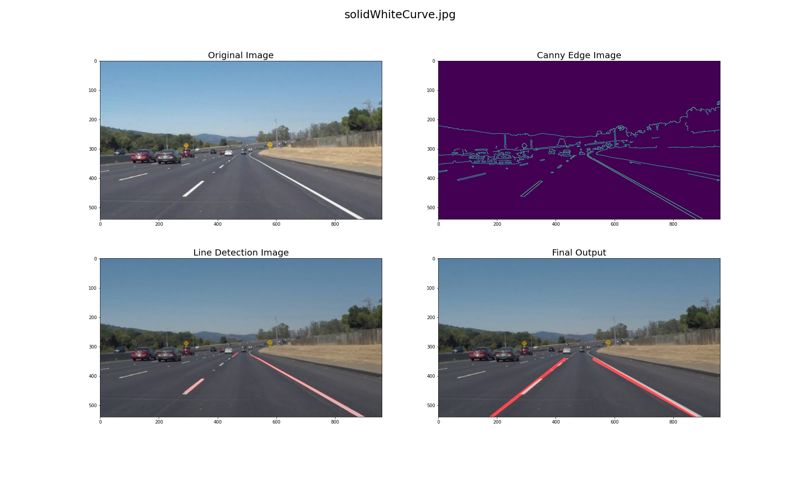

# **Finding Lane Lines on the Road** 

## Writeup by Sakshay Mahna

---

**Finding Lane Lines on the Road**

The goals / steps of this project are the following:
* Make a pipeline that finds lane lines on the road
* Reflect on your work in a written report

[//]: # (Image References)

[image1]: ./test_images_output/solidWhiteCurve.jpg "Solid White Curve"
[image2]: ./test_images_output/solidWhiteRight.jpg "Solid White Right"
[image3]: ./test_images_output/solidYellowCurve.jpg "Solid Yellow Curve"
[image4]: ./test_images_output/solidYellowCurve2.jpg "Solid Yellow Curve"
[image5]: ./test_images_output/solidYellowLeft.jpg "Solid Yellow Left"
[image6]: ./test_images_output/whiteCarLaneSwitch.jpg "White Car Lane Switch"

---

### Reflection

### 1. Describe your pipeline. As part of the description, explain how you modified the draw_lines() function.

My pipeline consisted of 5 steps.

1. Convert the image to grayscale
2. Apply a Gaussian Blur over the image
3. Get all the edges in the image using Canny Edge Detection algorithm
4. Crop the Region of Interest(in the shape of a triangle) from the edge image
5. Apply Hough Transform on the image to get a list of slopes of the lane lines
6. Extrapolate the lines using the calculated slopes(more information further)

To draw a single line on the left and right lanes, consisted of the following steps:

1. Segregate the positive and negative slopes from the list of slopes
2. Calculate the average of both the slopes
3. For the left lane line, positive slope is taken and the line is drawn starting from a point near apex of ROI and ending towards the bottom or left boundary of the image.
4. For the right lane line, negative slope is taken and the line is drawn starting from a point near apex of ROI and ending towards the bottom or right boundary of the image.

Example image showing the major steps of the pipeline

### 2. Identify potential shortcomings with your current pipeline
One potential shortcoming would be that the pipeline does not work for steeply curved roads. For such roads the pipeline would detect erroneous slanting lines and would not have a proper visualization. One resolution would be to dynamically reduce the starting point of the lines as the lanes would appear to be lines near the camera but curve out eventually.

Another shortcoming is that on a bumpy road the pipeline would give erroneous results. Dynamic tuning of parameters would help solve this problem.

Another shortcoming could be that the designed pipeline only works for the specific camera adjustment. If in the future, the camera position or orientation is slightly changed or the camera itself, the pipeline parameters would need to be retuned in order to account for the changed offsets.

### 3. Suggest possible improvements to your pipeline
A possible improvement would be to have dynamically changing parameters. This would enable the pipeline to become more robust to various terrain and camera position changes that would occur during a drive.

Another potential improvement could be to design the pipeline for general Hough Transform (more or less). This way, lanes that are not only straight but also curved would also be detected. However, the average technique for extrapolation would need to be redesigned to work with the general transform.
